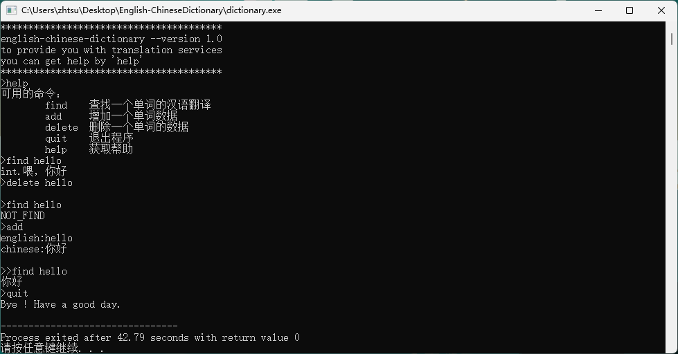

# English-ChineseDictionary

A English-Chinese dictionary in console that coded in C++. This is my final assignments for the thired-year Data Structures and Algorithms course.

# IDE

Dev-C++

# Screenshots

